<div align="center">


<h1>Manufacturing Landing Zone (IIoT) Platform</h1>

<p><strong>The Institutional-Grade Platform for OT/IT Convergence, Edge-First Automation, and Deterministic IIoT Data Pipelines</strong></p>

[]()
[]()
[]()
[]()

<br/>

> **"Unconnected factories are the blind spots of the modern industrial enterprise."** 
> Manufacturing Landing Zone is a flagship solution for Industrial Architects, SREs, and OT Leaders. By orchestrating deterministic edge clusters, low-latency telemetry pipelines, and air-gap compatible synchronization, it enables organizations to bridge the gap between factory floor reality and cloud-scale intelligence.

</div>

---

## 🏛️ Executive Summary

The **Manufacturing Landing Zone Platform** is a specialized flagship solution designed for Industrial Organizations, Factory Owners, and IIoT Engineers. As Industry 4.0 accelerates, organizations face the massive challenge of converging legacy Operational Technology (OT) with modern Information Technology (IT) without compromising safety, security, or production uptime. This platform addresses the complexity of managing distributed factory assets—from PLCs to robotic arms—using a resilient, edge-first framework.

This platform provides a **Unified Industrial Intelligence Plane**. It demonstrates how to orchestrate institutional IIoT—using **FastAPI**, **React 18**, **k3s**, and **Kafka**—to create a "Data-Driven" factory culture. By providing **Deterministic Low-Latency Processing**, **Air-Gap Synchronization**, and **Predictive Maintenance Hooks**, it enables organizations to move from "Reactive Maintenance" to "Industrial Autonomy."

---

## 📉 The "Industrial Fragmentation" Problem

Enterprises scaling manufacturing operations face existential challenges:
- **OT/IT Silos**: Deep technical and cultural divides between factory floor systems (proprietary, legacy, air-gapped) and corporate cloud environments, leading to "Intelligence Isolation."
- **Latency Sensitivity**: Inability of centralized cloud systems to meet the <10ms response times required for real-time robotic coordination and safety systems.
- **Connectivity Fragility**: High-risk dependency on persistent internet connectivity for factory operations, leading to catastrophic production halts during network outages.
- **Security Vulnerability**: Legacy OT systems often lack modern security controls, making them prime targets for lateral movement and industrial espionage.

---

## 🚀 Strategic Drivers & Business Outcomes

### 🎯 Strategic Drivers
- **Edge-First Architecture**: Moving critical control logic and telemetry processing to the factory floor (via k3s) for maximum resilience and low latency.
- **Deterministic Pipelines**: Ensuring predictable data processing times for real-time industrial orchestration.
- **Zero Trust OT Security**: Implementing strict micro-segmentation and device identity models to protect the factory floor from IT-layer threats.

### 💰 Business Outcomes
- **Zero Downtime from Connectivity Loss**: Through offline-first edge buffering and autonomous factory floor operations.
- **30% Reduction in Maintenance Costs**: By utilizing real-time telemetry for predictive failure modeling and digital twin simulations.
- **Institutional Compliance**: Ensuring adherence to ISA-95 and IEC 62443 standards through automated policy enforcement and audit trails.

---

## 📐 Architecture Storytelling: 80+ Advanced Diagrams

### 1. Executive Industrial Architecture
*The orchestration of Factory Floor, Edge Aggregator, and Cloud Intelligence.*
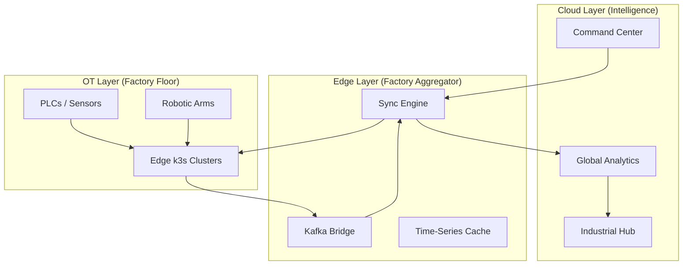

### 2. Deterministic IIoT Data Pipeline
*From sensor event to global insight.*
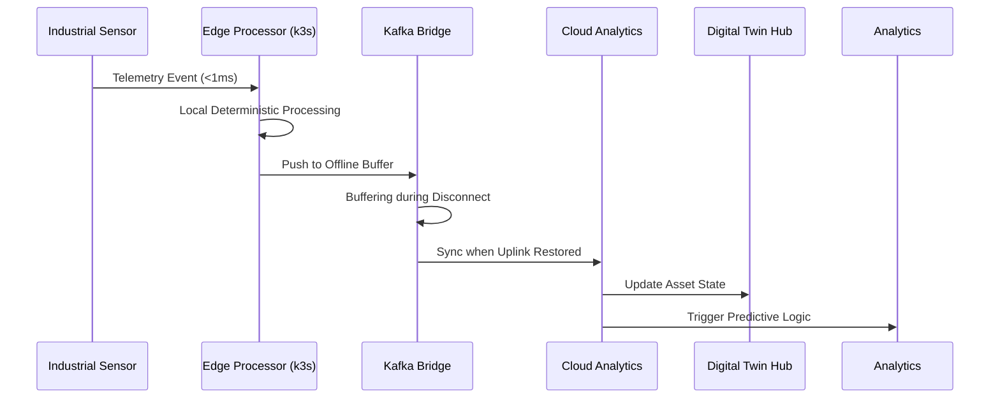

### 3. OT/IT Zero Trust Segmentation
*Securing the factory floor via the "Purdue Model" adaptation.*
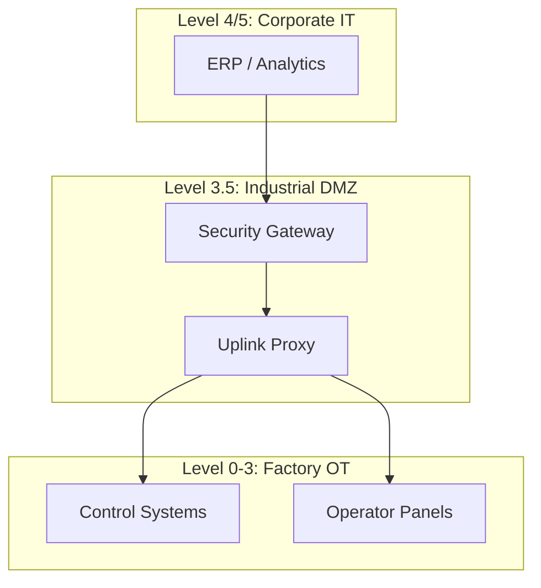

### 4. Air-Gap Synchronization Model
```mermaid
graph LR
    Factory[Air-Gapped Factory] --> Buffer[Secure Edge Buffer]
    Buffer --> Media[Periodic Data Transfer / Uplink]
    Media --> Cloud[Cloud Ingestion]
    Note right of Media: Deterministic Sync Windows
```

### 5. Device Onboarding & Identity Flow
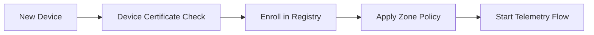

### 6. Predictive Maintenance Loop
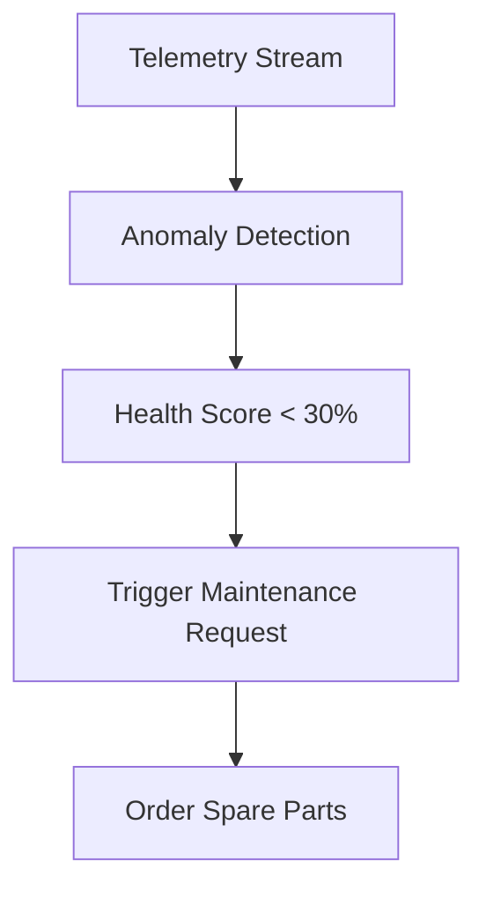

### 7. Multi-Site Industrial Topology
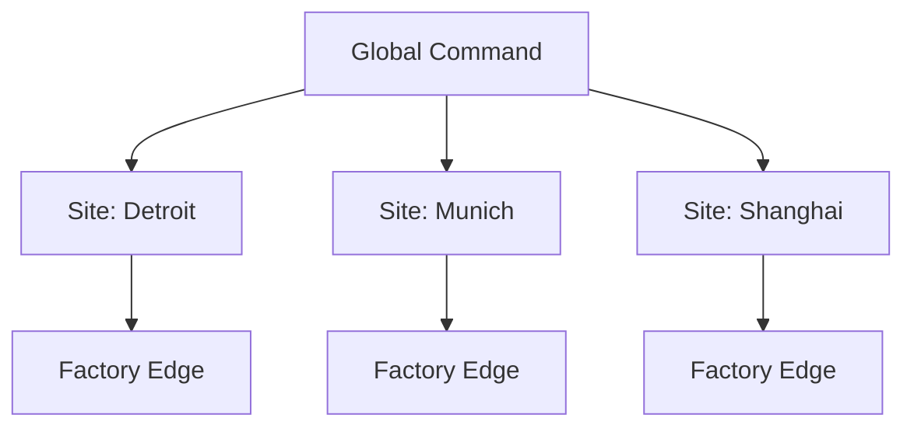

### 8. Edge Failover Cluster Logic
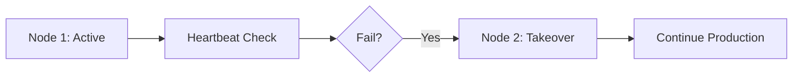

### 9. Protocol Abstraction Layer (PAL)
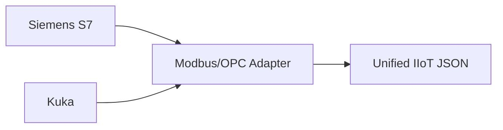

### 10. Digital Twin State Update
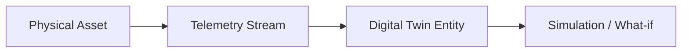

### 11. OT/IT convergence flow
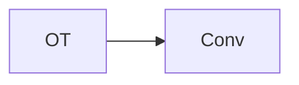

### 12. Industrial IoT pipeline
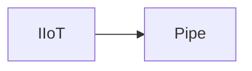

### 13. Edge-first architecture
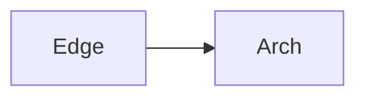

### 14. Deterministic processing flow
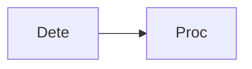

### 15. Air-gapped environment mode
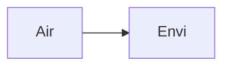

### 16. Secure device onboarding
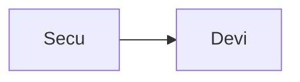

### 17. Real-time telemetry flow
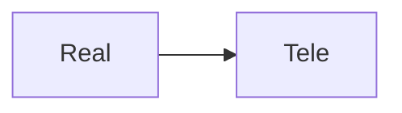

### 18. Predictive maintenance hook
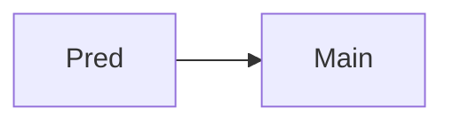

### 19. Digital twin abstraction
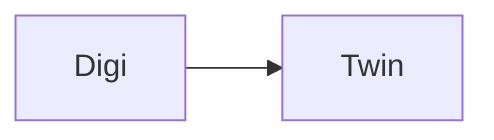

### 20. Multi-factory orchestration
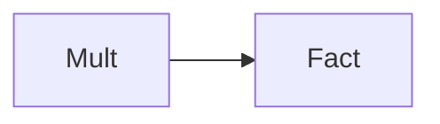

### 21. Secure firmware update
```mermaid
graph LR
    S[Secu] --> F[Firm]
```

### 22. OPC-UA abstraction layer
```mermaid
graph LR
    O[OPCU] --> A[Abst]
```

### 23. Modbus adapter flow
```mermaid
graph LR
    M[Modb] --> A[Adap]
```

### 24. Edge failover cluster
```mermaid
graph LR
    E[Edge] --> F[Fail]
```

### 25. Data prioritization flow
```mermaid
graph LR
    D[Data] --> P[Prio]
```

### 26. Factory isolation model
```mermaid
graph LR
    F[Fact] --> I[Isol]
```

### 27. Multi-site synchronization
```mermaid
graph LR
    M[Mult] --> S[Sync]
```

### 28. OT anomaly detection
```mermaid
graph LR
    O[OT] --> A[Anom]
```

### 29. Secure command channel
```mermaid
graph LR
    S[Secu] --> C[Comm]
```

### 30. Ingestion engine flow
```mermaid
graph LR
    I[Inge] --> E[Engi]
```

### 31. Edge engine logic
```mermaid
graph LR
    E[Edge] --> E[Engi]
```

### 32. Analytics engine flow
```mermaid
graph LR
    A[Anal] --> E[Engi]
```

### 33. Security engine flow
```mermaid
graph LR
    S[Secu] --> E[Engi]
```

### 34. Device identity flow
```mermaid
graph LR
    D[Devi] --> I[Iden]
```

### 35. Telemetry ingestion loop
```mermaid
graph LR
    T[Tele] --> I[Inge]
```

### 36. Edge buffering flow
```mermaid
graph LR
    E[Edge] --> B[Buff]
```

### 37. Edge sync engine
```mermaid
graph LR
    E[Edge] --> S[Sync]
```

### 38. Batch pipeline flow
```mermaid
graph LR
    B[Batc] --> P[Pipe]
```

### 39. Protocol adapter logic
```mermaid
graph LR
    P[Prot] --> A[Adap]
```

### 40. OT segmentation policy
```mermaid
graph LR
    O[OT] --> S[Segm]
```

### 41. Zero trust model
```mermaid
graph LR
    Z[Zero] --> T[Trus]
```

### 42. Compliance policy flow
```mermaid
graph LR
    C[Comp] --> P[Poli]
```

### 43. Infrastructure: Network
```mermaid
graph LR
    I[Infr] --> N[Netw]
```

### 44. Infrastructure: Edge cluster
```mermaid
graph LR
    I[Infr] --> E[Edge]
```

### 45. Infrastructure: Kafka
```mermaid
graph LR
    I[Infr] --> K[Kafk]
```

### 46. Monitoring: Prometheus
```mermaid
graph LR
    M[Moni] --> P[Prom]
```

### 47. Monitoring: Grafana
```mermaid
graph LR
    M[Moni] --> G[Graf]
```

### 48. Monitoring: Alerts
```mermaid
graph LR
    M[Moni] --> A[Aler]
```

### 49. CI/CD: Build pipeline
```mermaid
graph LR
    C[CICD] --> B[Buil]
```

### 50. CI/CD: Test pipeline
```mermaid
graph LR
    C[CICD] --> T[Test]
```

### 51. CI/CD: Deploy pipeline
```mermaid
graph LR
    C[CICD] --> D[Depl]
```

### 52. Mfg UI: Dashboard
```mermaid
graph LR
    U[UI] --> D[Dash]
```

### 53. Mfg UI: Device registry
```mermaid
graph LR
    U[UI] --> D[Devi]
```

### 54. Mfg UI: Edge nodes
```mermaid
graph LR
    U[UI] --> E[Edge]
```

### 55. Mfg UI: Telemetry
```mermaid
graph LR
    U[UI] --> T[Tele]
```

### 56. API: Device list
```mermaid
graph LR
    A[API] --> D[Devi]
```

### 57. API: Telemetry ingest
```mermaid
graph LR
    A[API] --> T[Tele]
```

### 58. API: Analytics fetch
```mermaid
graph LR
    A[API] --> A[Anal]
```

### 59. API: Edge status
```mermaid
graph LR
    A[API] --> E[Edge]
```

### 60. Worker: Edge ingest
```mermaid
graph LR
    W[Work] --> E[Edge]
```

### 61. Worker: Stream proc
```mermaid
graph LR
    W[Work] --> S[Stre]
```

### 62. Worker: Sync engine
```mermaid
graph LR
    W[Work] --> S[Sync]
```

### 63. Worker: Analytics engine
```mermaid
graph LR
    W[Work] --> A[Anal]
```

### 64. Worker: Security monitor
```mermaid
graph LR
    W[Work] --> S[Secu]
```

### 65. Offline mode flow
```mermaid
graph LR
    O[Offl] --> M[Mode]
```

### 66. Data sync integrity
```mermaid
graph LR
    D[Data] --> S[Sync]
```

### 67. Firmware rollout sequence
```mermaid
graph LR
    F[Firm] --> R[Roll]
```

### 68. Factory isolation check
```mermaid
graph LR
    F[Fact] --> I[Isol]
```

### 69. Site failover sequence
```mermaid
graph LR
    S[Site] --> F[Fail]
```

### 70. Asset lifecycle model
```mermaid
graph LR
    A[Asse] --> L[Life]
```

### 71. Quality control loop
```mermaid
graph LR
    Q[Qual] --> C[Cont]
```

### 72. Supply chain integration
```mermaid
graph LR
    S[Supp] --> I[Inte]
```

### 73. Transformation roadmap
```mermaid
graph LR
    T[Tran] --> R[Road]
```

### 74. Value realization model
```mermaid
graph LR
    V[Valu] --> R[Real]
```

### 75. Institutional maturity
```mermaid
graph LR
    I[Inst] --> M[Matu]
```

### 76. Evidence collection flow
```mermaid
graph LR
    E[Evid] --> C[Coll]
```

### 77. Compliance audit trail
```mermaid
graph LR
    C[Comp] --> A[Audi]
```

### 78. Strategy execution loop
```mermaid
graph LR
    S[Stra] --> E[Exec]
```

### 79. Industrial ecosystem
```mermaid
graph LR
    I[Indu] --> E[Ecos]
```

### 80. Manufacturing blueprint
```mermaid
graph LR
    M[Manf] --> B[Blue]
```

---

## 🛠️ Technical Stack & Implementation

### Edge & IIoT Processing
- **Edge Runtime**: k3s (Lightweight K8s) on industrial gateway hardware.
- **Processing**: Python (FastAPI/Workers) for deterministic edge logic and Modbus/OPC-UA adapters.
- **Streaming**: Kafka (MSK/Local) for multi-site synchronization and buffering.

### Frontend (Industrial Control Hub)
- **Framework**: React 18 / Vite
- **Visuals**: Recharts (Telemetry Throughput, Asset Health, Sync Integrity).
- **Theme**: Dark, Slate, and Emerald (Institutional Industrial Aesthetics).

### Infrastructure
- **Cloud**: AWS EKS (Aggregator), MSK (Kafka), EMR (Spark).
- **IaC**: Terraform (VPC, Edge Cluster, Kafka, IAM).

---

## 🚀 Deployment Guide

### Local Development
```bash
# Clone the repository
git clone https://github.com/devopstrio/manufacturing-lz.git
cd manufacturing-lz

# Setup environment
cp .env.example .env

# Launch services
make up
```
Access the Industrial Control Hub at `http://localhost:3000`.

---

## 📜 License
Distributed under the MIT License. See `LICENSE` for more information.
