<div align="center">


<h1>Manufacturing Landing Zone</h1>

<p><strong>The Institutional-Grade Platform for OT/IT Convergence, Edge-First Automation, and Deterministic IIoT Data Pipelines.</strong></p>

[]()
[]()
[]()

<br/>

> **"Unconnected factories are the blind spots of the modern industrial enterprise."** 
> **Manufacturing Landing Zone** is an enterprise-grade platform designed to provide a secure, measurable, and highly automated foundation for global industrial operations. It orchestrates the complex lifecycle of industrial data—from edge-first sensor ingestion and local processing to cloud-scale digital twin simulations and unified OT/IT governance.

</div>

---

## 🏛️ Executive Summary

Fragmented factory floor data and manual maintenance processes are strategic operational liabilities; lack of centralized industrial orchestration is a primary barrier to organizational Industry 4.0 scaling. Organizations fail to achieve rapid factory intelligence not because of a lack of sensors, but because of fragmented data standards, lack of automated edge processing, and an inability to orchestrate OT/IT convergence with operational precision.

This platform provides the **Industrial Intelligence Plane**. It implements a complete **Enterprise Manufacturing-as-Code Framework**, enabling Factory Engineering and Operations teams to manage global industrial assets as first-class citizens. By automating the ingestion of high-frequency sensor data and orchestrating real-time predictive maintenance, we ensure that every organizational asset—from robotic assembly lines to critical power systems—is monitored by default, audited for history, and strictly aligned with institutional ISA-95/IEC 62443 frameworks.

---

## 📐 Architecture Storytelling: Principal Reference Models

### 1. Principal Architecture: Global Manufacturing Landing Zone & Industrial Intelligence Plane
This diagram illustrates the end-to-end flow from edge sensor ingestion and local processing to cloud-scale digital twins, predictive maintenance, and institutional industrial auditing.

```mermaid
graph LR
    %% Subgraph Definitions
    subgraph FactoryFloor["Factory Floor (OT Ingress)"]
        direction TB
        Sensors["Industrial Sensors (MQTT/OPC-UA)"]
        PLCs["Programmable Logic Controllers"]
        Robots["Robotic Assembly Units"]
    end

    subgraph IntelligenceEngine["Industrial Intelligence Hub"]
        direction TB
        API["FastAPI Industrial Gateway"]
        EdgeManager["Distributed Edge Orchestrator"]
        TwinHub["Digital Twin Simulation Hub"]
        Predictor["Predictive Maintenance Engine"]
    end

    subgraph ExecutionPlane["Distributed Edge Fleet (k3s)"]
        direction TB
        LocalNodes["Deterministic Edge Clusters"]
        OfflineBuffers["Secure Message Buffers"]
        SyncWorkers["Cloud-Edge Sync Workers"]
    end

    subgraph OperationsHub["Institutional Industrial Hub"]
        direction TB
        Scorecard["Factory Maturity Score"]
        Analytics["OEE & Production Stats"]
        Audit["Forensic Industrial Metadata Lake"]
    end

    subgraph DevOps["Manufacturing-as-Code Orchestration"]
        direction TB
        TF["Terraform Industrial Modules"]
        SecPolicy["OT/IT Segmentation Policy"]
        ChatOps["Command Approval Hub"]
    end

    %% Flow Arrows
    FactoryFloor -->|1. Stream Telemetry| API
    API -->|2. Register Device| EdgeManager
    EdgeManager -->|3. Deploy Logic| ExecutionPlane
    ExecutionPlane -->|4. Sync Asset State| TwinHub
    
    TwinHub -->|5. Predict Failure| Predictor
    Predictor -->|6. Notify Command| ChatOps
    API -->|7. Visualize Health| Scorecard
    
    Scorecard -->|8. Track OEE| Analytics
    Scorecard -->|9. Record Event| Audit
    
    TF -->|10. Provision Hub| IntelligenceEngine
    SecPolicy -->|11. Enforce Segmentation| ExecutionPlane
    Audit -->|12. Improve Models| Predictor

    %% Styling
    classDef ingress fill:#f5f5f5,stroke:#616161,stroke-width:2px;
    classDef intel fill:#e8f5e9,stroke:#2e7d32,stroke-width:2px;
    classDef execution fill:#e1f5fe,stroke:#01579b,stroke-width:2px;
    classDef ops fill:#ede7f6,stroke:#311b92,stroke-width:2px;
    classDef devops fill:#fffde7,stroke:#f57f17,stroke-width:2px;

    class FactoryFloor ingress;
    class IntelligenceEngine intel;
    class ExecutionPlane execution;
    class OperationsHub ops;
    class DevOps devops;
```

### 2. The Industrial Data Lifecycle Flow
The continuous path of an industrial signal from initial edge ingestion and processing to active simulation, actuation, and institutional forensic auditing.

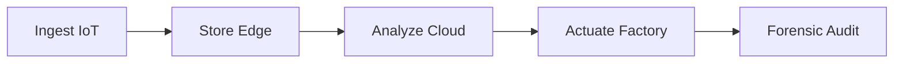

### 3. IIoT Edge & Factory Connectivity Topology
Strategically connecting PLC and SCADA systems through unified institutional gateways (OPC-UA/MQTT), providing a single point of entry for secure factory-to-cloud communication.

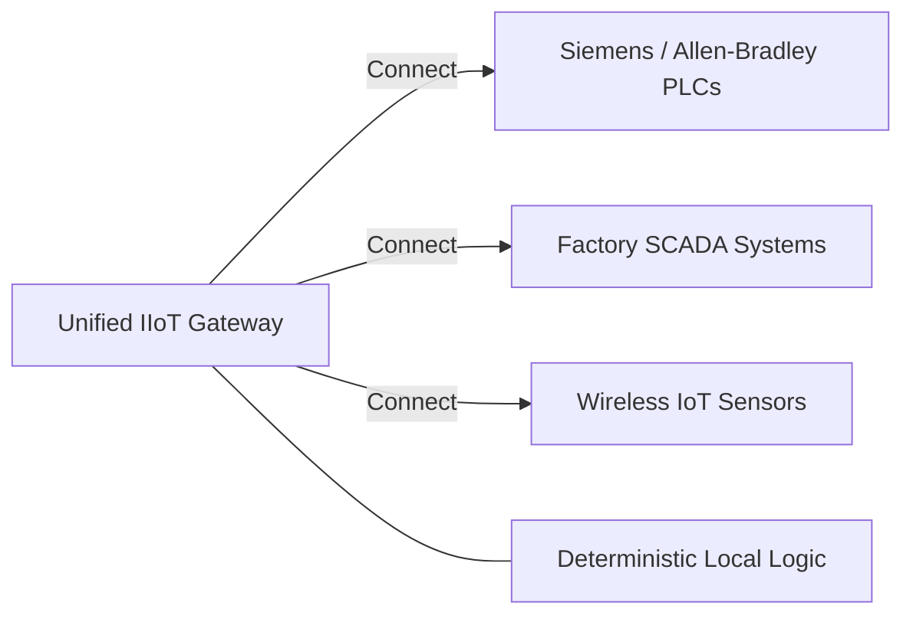

### 4. Distributed Edge Computing & Local Processing Flow
Executing critical low-latency control logic and data normalization on-site (at the factory edge) before cloud egress, ensuring production continuity even during internet outages.

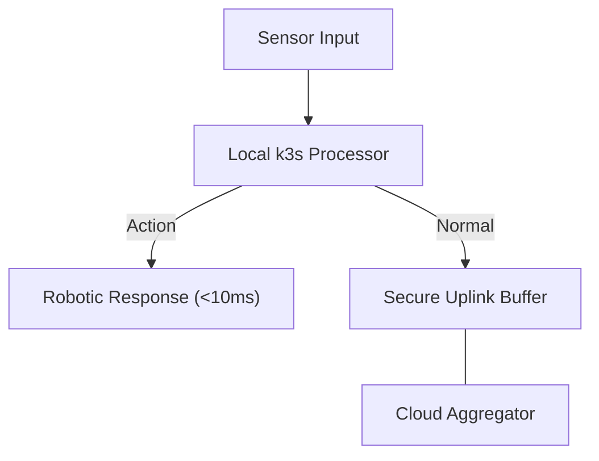

### 5. Digital Twin & Asset Simulation Flow
Mirroring physical factory assets in a virtual cloud environment, enabling real-time state tracking and high-fidelity "what-if" simulations for production optimization.

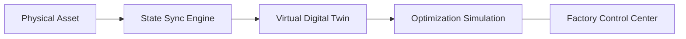

### 6. Predictive Maintenance & Quality Control Flow
Identifying potential equipment failures or product defects using advanced ML models, triggering automated maintenance requests before production is impacted.

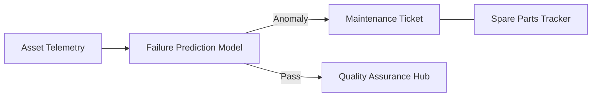

### 7. Institutional Manufacturing Maturity Scorecard
Grading organizational performance based on key indicators: Factory Uptime, OEE (Overall Equipment Effectiveness), and Industrial Safety Metrics.

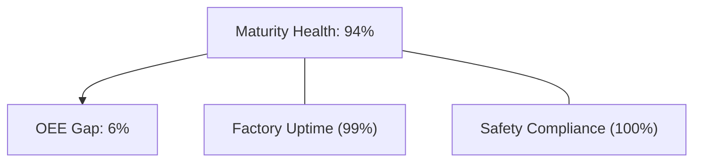

### 8. Identity & RBAC for Industrial Governance
Managing fine-grained access to factory control channels, asset state, and audit logs between Factory Managers, Maintenance Engineers, and Data Scientists.

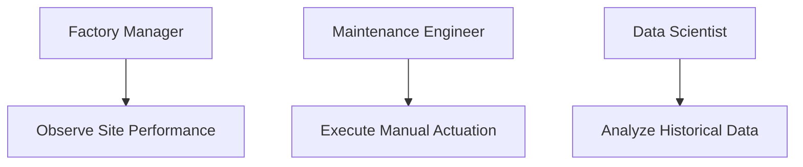

### 9. IaC Deployment: Manufacturing-LZ-as-Code Framework
Using modular Terraform to deploy and manage the versioned distribution of the industrial tracking hubs, edge clusters, and forensic metadata lakes.

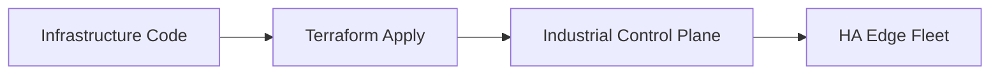

### 10. AIOps Factory Health & Anomaly Validation Flow
Using advanced analytics to identify anomalous sensor readings or hidden production bottlenecks, identifying potential equipment stress before it results in a halt.

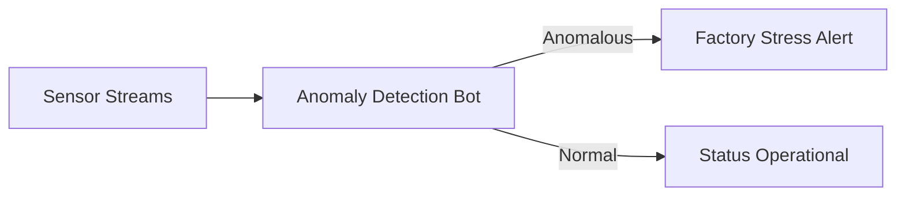

### 11. Metadata Lake for Forensic Industrial Audit
Storing long-term records of every sensor reading, maintenance event, and safety alert for institutional record-keeping, compliance auditing, and post-incident forensics.

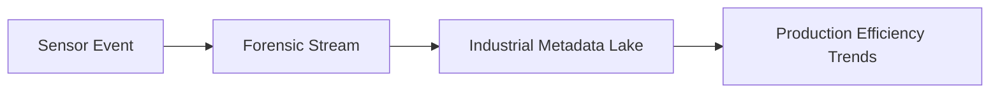

---

## 🏛️ Core Manufacturing Pillars

1.  **Deterministic Edge Intelligence**: Maximizing response speed and reliability through local, low-latency processing.
2.  **High-Fidelity Digital Twins**: Ensuring real-time synchronization between physical assets and virtual models.
3.  **Autonomous Production Resiliency**: Guaranteeing factory uptime during cloud connectivity disruptions through edge buffering.
4.  **Zero-Trust OT/IT Segmentation**: Protecting critical factory floor assets through strict micro-segmentation and device identity.
5.  **Predictive Operational Excellence**: Eliminating unplanned downtime through continuous machine-learning-driven monitoring.
6.  **Full Industrial Auditability**: Immutable recording of every sensor reading and control decision for institutional forensics.

---

## 🛠️ Technical Stack & Implementation

### Industrial Engine & APIs
*   **Framework**: Python 3.11+ / FastAPI.
*   **Edge Runtime**: k3s (Lightweight Kubernetes) for deterministic factory logic.
*   **Messaging Core**: Kafka (MSK) with local edge buffering capabilities.
*   **Persistence**: PostgreSQL (Metadata Lake) and Redis (Live State Cache).
*   **Auth Orchestrator**: Federated OIDC/SAML for least-privilege industrial asset access.

### Control Hub (UI)
*   **Framework**: React 18 / Vite.
*   **Theme**: Dark, Slate, Emerald (Modern high-fidelity industrial aesthetic).
*   **Visualization**: D3.js for asset topology and Recharts for OEE and telemetry analytics.

### Infrastructure & DevOps
*   **Runtime**: AWS EKS (Cloud Aggregator) and local industrial gateway hardware (Edge).
*   **Security Plane**: Managed segmentation via AWS PrivateLink and industrial firewalls.
*   **IaC**: Modular Terraform for deploying the manufacturing landing zone and edge fleet.

---

## 🏗️ IaC Mapping (Module Structure)

| Module | Purpose | Real Services |
| :--- | :--- | :--- |
| **`infrastructure/mfg_hub`** | Central management plane | EKS, PostgreSQL, Redis |
| **`infrastructure/edge_nodes`** | Factory floor clusters | k3s, Industrial Gateways |
| **`infrastructure/connectivity`** | Secure OT/IT Bridge | Site-to-Site VPN, PrivateLink |
| **`infrastructure/auditing`** | Forensic industrial sinks | S3, Athena, Quicksight |

---

## 🚀 Deployment Guide

### Local Principal Environment
```bash
# Clone the manufacturing platform
git clone https://github.com/devopstrio/manufacturing-lz.git
cd manufacturing-lz

# Configure environment
cp .env.example .env

# Launch the Manufacturing stack
make init

# Trigger a mock sensor ingestion and predictive maintenance simulation
make simulate-industrial
```

Access the Industrial Control Hub at `http://localhost:3000`.

---

## 📜 License
Distributed under the MIT License. See `LICENSE` for more information.

---
<div align="center">
  <p>© 2026 Devopstrio. All rights reserved.</p>
</div>
