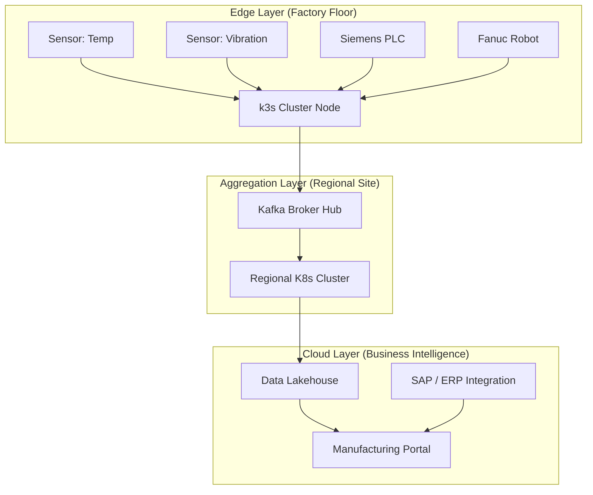
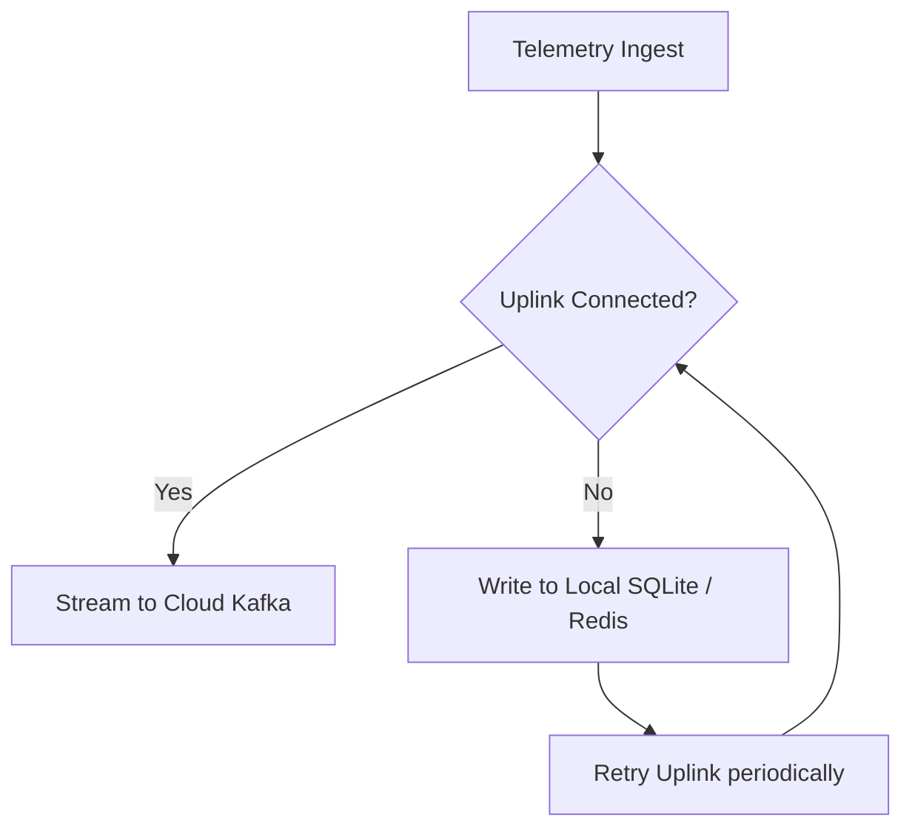
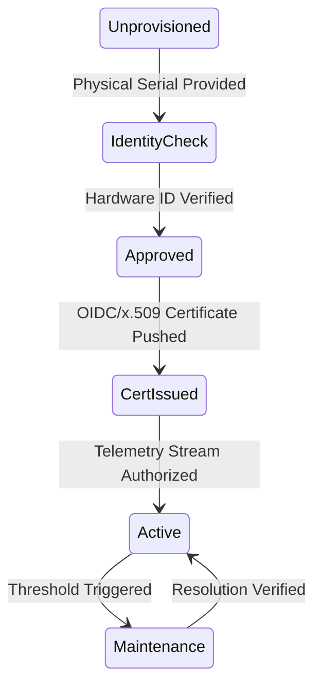

# Architecture & OT/IT Diagrams

## 11. OT/IT Converged Topology (Detailed)
*How factory floor assets interact with cloud intelligence via the Edge Layer.*

## 13. "Offline-First" Buffering Logic

## 20. Device Provisioning State Machine

