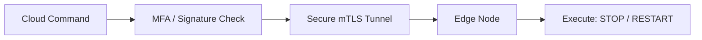
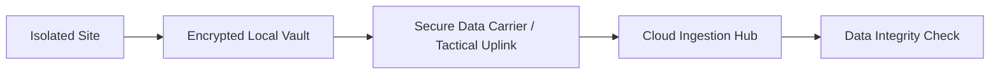

# IIoT Security & Sync Diagrams

## 31. Zero Trust OT Segmentation
```mermaid
graph TD
    subgraph "Zone A: Production Line 1"
        R1[Robot 1]
        P1[PLC 1]
    end
    subgraph "Zone B: Production Line 2"
        R2[Robot 2]
        P2[PLC 2]
    end
    subgraph "DMZ: Edge Gateway"
        GW[Firewall / Envoy Proxy]
    end

    R1 --> GW
    P1 --> GW
    R2 --> GW
    P2 --> GW
    Note right of GW: Zone-to-Zone traffic blocked
```

## 34. Secure Command & Control Channel


## 40. "Air-Gap" Data Exfiltration Protocol

